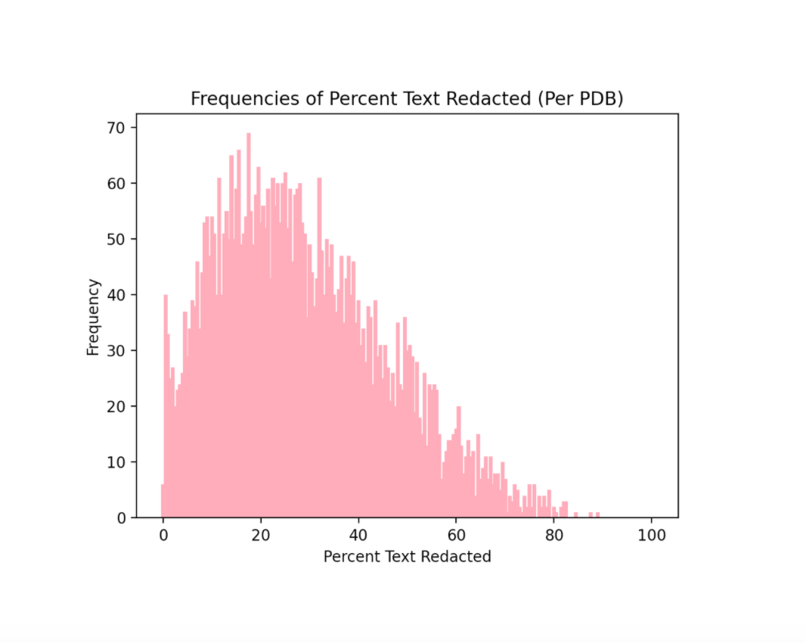

# Redactions Project 

A Python-based project that utilizes OpenCV to detect and analyze redactions in declassified President's Daily Briefs from the mid-20th Century.


# Analyzing Redactions

## Getting Started

Prepare two directories:
- A directory containing _only_ pdf files of PDBs (the "from" directory)
- An empty directory (the "to" directory)

As the script analyzes each PDB, it will move the files from the "from" directory to the "to" directory. This is a safety measure; if the script gets interrupted at any point, you can pick up where you left off and avoid reanalyzing any PDBs. 

## Running the Script

To find the redactions in a __batch__ of PDBs and generate a CSV file containing the data: 

```bash
python3 pdb_stats.py batch from_directory to_directory
```
You should expect to see a table being generated on the screen. Note that the raw data will be stored in __pdb_output.csv__ for future use if necessary.

To generate graphs and __analyze__ the data in the CSV file: 

```bash
python3 pdb_stats.py analyze
```
You should expect graphs to appear in a pop-up window. See below for an example.



# Analyzing and Displaying a Single Page

Analyzing the redactions on a single page of a PDB file and display an image with the identified redactions.

## Running the Script

```bash
python3 redactions_show.py jpg_filepath
```
- __jpg_filepath__ is the filepath for a single page of a PDB. It must be a .jpg file.
- Running this script will calculate the number of redactions, the percent of text on the page that was redacted, as well as the estimated number of words that were redacted. It will also open a pop-up window containing an image that clearly identifies the locations of the redactions on the page.
- Exiting out of the pop-up window will automatically take a screenshot so you can save the analyzed image for future reference.

# How Does It Work?

Our script makes use of OpenCV’s built-in contour and shape detection features to identify the white redaction boxes on each page of a PDB document. 


By calculating the area of the redaction in comparison to text on the page, we can estimate the number of words that were redacted as well as what percent of text on the page was redacted.

